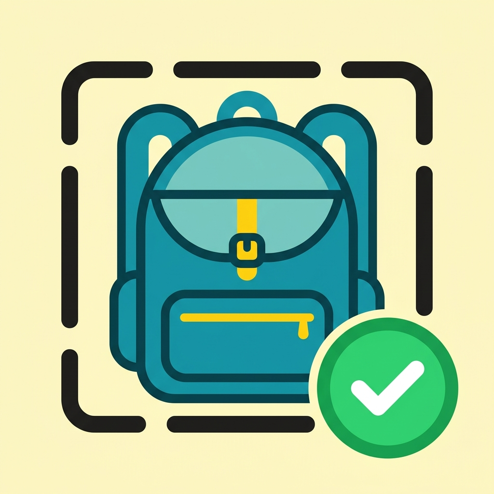

<div align="center">



# Snap & Pack

**カバンを撮ると、AIが怒る。/ Snap your bag. The AI yells.**

忘れ物ゼロを実現する AI 検問アプリ — 予定から持ち物リストを自動生成し、
カバンの写真と照合して「足りない物」を声で教えてくれます。

Built in one day at **Builders Weekend Tokyo**(Takeoff Tokyo × RevenueCat Shipaton 2026 Special)

</div>

---

## なぜ作ったか / Why

忘れ物はリストが無いから起きるのではない。
**リストと現実の照合を人間がサボるから起きる。**

ChatGPT は持ち物リストを作ってくれるが、カバンの中までは見てくれない。
Snap & Pack は現実のカバンを見て、向こうから突っ込んでくる。

> Forgetting things doesn't happen because you lack a list — it happens because
> humans skip checking the list against reality. Chat AIs write packing lists,
> but they never look inside your bag. Snap & Pack does.

## 体験の1本道 / Core Experience

1. **📅 予定を選ぶ** — 端末カレンダー(Google カレンダー同期)から今日の予定を取得。AI が予定の内容とあなたの所持品から必要な持ち物リストを自動算出。固定プリセット(ハッカソン/授業/バイト)も選べる
2. **📷 カバンを撮る** — 最大3枚(角度を変えると遮蔽に強い)。オンデバイス ML(ML Kit)が即座に物体数を検出し、クラウド Vision AI がリストと照合
3. **🚨 検問** — 足りない物があれば赤画面+**最大音量の絶叫**+バイブで引き止める。全部あれば緑の「**出発ヨシ!**」

## 特徴 / Features

| | |
|---|---|
| 🤖 **AI 持ち物算出** | カレンダーの予定タイトル・時刻・場所から必要な物を選択。「歯医者」→ 保険証・診察券、「飲み会」→ ブレスケアまで提案 |
| 📸 **Vision 検問** | 写真とリストの差分を Gemini Vision が判定(Claude API へ自動フォールバック)。複数枚は「どれか1枚に写っていれば所持」 |
| 🧳 **マイアイテム** | 所持品カタログを登録。**実物の参照写真**を付けると few-shot でその個体を認識 — 特殊な持ち物にも強い |
| 🧠 **フィードバック学習** | 誤判定に「実はあった!」→ 記録が蓄積され、次回からそのアイテムに甘め判定 |
| ⚡ **2段判定** | 1段目: ML Kit オンデバイス物体検出(通信ゼロ・即応答)/ 2段目: クラウド Vision の意味照合 |
| 🌏 **日英対応** | UI・音声(TTS)とも日本語/英語をワンタップ切替 |
| 📴 **オフライン耐性** | API 全滅時はローカル簡易判定に自動フォールバック。デモモード(タイトル3秒長押し)で通信ゼロ動作 |

## 技術スタック / Tech Stack

- **Flutter 3** (Android) — Material 3
- **Gemini 2.x Flash** (vision + text, structured output) → **Claude** fallback
- **Google ML Kit** — on-device object detection
- **device_calendar** — 端末カレンダー読取(READ_CALENDAR のみ、OAuth 不要)
- flutter_tts / vibration / image_picker / shared_preferences
- **バックエンドなし** — 端末から直接 HTTPS。状態は全部ローカル

## ビルド / Build

```powershell
flutter pub get
flutter build apk --release `
  --dart-define=GEMINI_API_KEY=<your key> `
  --dart-define=ANTHROPIC_API_KEY=<optional fallback key>
```

キーはコードに含まれません。`GEMINI_API_KEY` は [Google AI Studio](https://aistudio.google.com/apikey) で発行できます。

### 判定パイプラインの検証(PC・実機不要)

```powershell
$env:GEMINI_API_KEY="<your key>"
dart run tool/vision_check.dart    # 写真→欠品検出の回帰テスト (8 cases)
dart run tool/suggest_check.dart   # 予定→持ち物算出の品質確認
```

## プロジェクト構成 / Layout

```
lib/
  main.dart              # エントリ・テーマ
  strings.dart           # 日英文言 (ja/en map)
  presets.dart           # アイテム/プリセット定義
  store.dart             # 永続化 (マイアイテム・編集・学習・キャッシュ)
  calendar.dart          # 端末カレンダー読取
  api.dart               # Gemini/Claude Vision + 持ち物算出
  local_ml.dart          # ML Kit オンデバイス検出
  screens/               # home / check / result / my_items
tool/
  vision_check.dart      # 判定回帰テストハーネス
  suggest_check.dart     # 提案品質ハーネス
  fixtures/              # テスト画像 (Wikimedia Commons)
```

## チーム / Team

2人+AI エージェント(Claude Code)で3時間ビルド。

## License

[Apache License 2.0](LICENSE) — Copyright 2026 Haruka Kaya

テスト画像(`tool/fixtures/`)は Wikimedia Commons 由来です(各画像のライセンスは Commons の各ファイルページに従います)。
